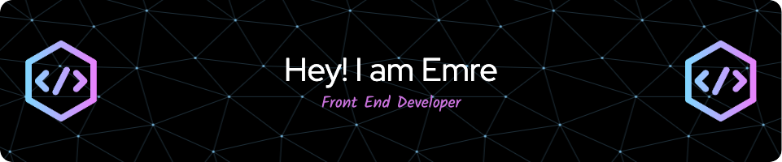

<h1 align="center">Hi , I'm Emre </h1>
<h3 align="center">A passionate frontend developer from Turkey  </h3>

  

- 💬 Ask me about **JS and ReactJS**

- 📫 How to reach me **mrzdnboun@gmail.com**

- ⚡ Fun fact **If you got to know me, you would like me a lot.**

<h3 align="left">Connect with me:</h3>

  

<h3 align="left">Languages and Tools:</h3>

           

&nbsp;

